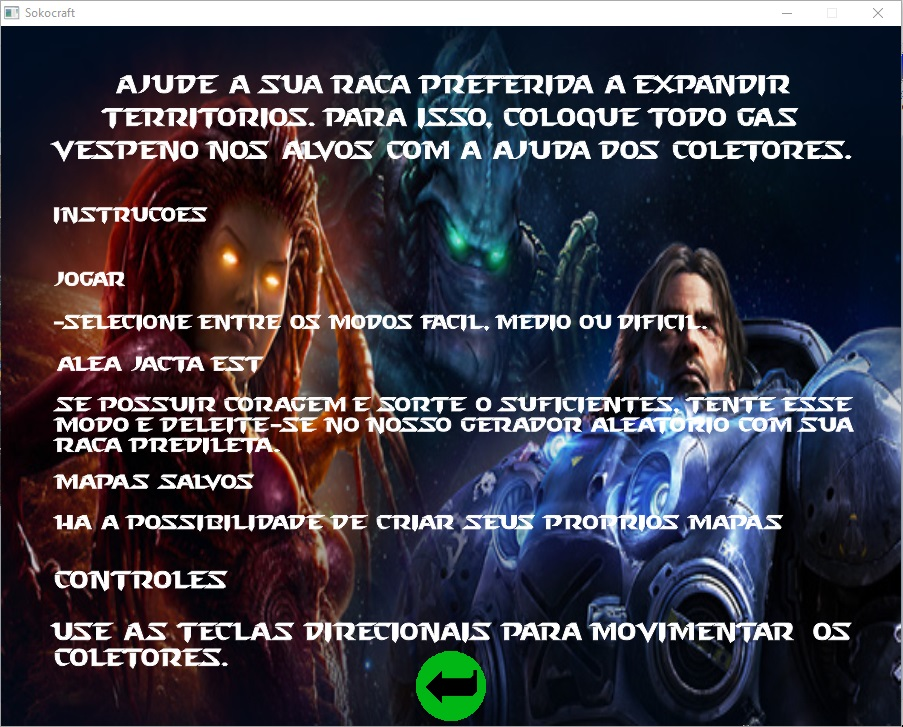

# SokoCraft
SokoCraft is a Sokoban game written in C with a theme based on StarCraft. It was developed back in 2014, on the discipline of "Computational Methods", at UFPE (Universidade Federal de Pernambuco). 

**Contributors**:
- Edmar Soares
- João Victor da Silva
- Karl Vandesman de Matos
- Murilo Viana

## About Sokoban
Sokoban (倉庫番 sōko-ban, "warehouse keeper") is a type of puzzle video game, in which the player pushes crates or boxes around in a warehouse, trying to get them to storage locations.

Sokoban was created in 1981 by Hiroyuki Imabayashi, and published in December 1982 by Thinking Rabbit, a software house based in Takarazuka, Japan.[1]

## Rules
The game is played on a board of squares, where each square is a floor or a wall. Some floor squares contain boxes, and some floor squares are marked as storage locations.

The player is confined to the board, and may move horizontally or vertically onto empty squares (never through walls or boxes). The player can also move into a box, which pushes it into the square beyond. Boxes may not be pushed into other boxes or walls, and they cannot be pulled. The number of boxes is equal to the number of storage locations. The puzzle is solved when all boxes are at storage locations.

For more information, visit: https://en.wikipedia.org/wiki/Sokoban.

## Screenshots
**1. Initialization screen. Just press enter.**

**2. Selecting your race (I said, its based on StarCraft haha).**

**3. The main screeen. Here you can go directly play the game, go to the editor or see our manual.**

**4. A little manual of instructions about the game.**

**5. The editor screen. Here you can create customized maps!**

**6. Here you can access the maps you've saved.**

**7. You can also access your progress using the correct password. Just like the old times!**

**8. Time to play! You just have to use the arrows keys to move.**

**9. After you put all "vespene gas" (our boxes...) into their places, you will pass to the next stage.**

## To do
There are a lot of things that we can still improve on this awesome game. For instance:
- The "IA" to generate new maps accordingly with a difficulty level chosen.
- The password generate by each stage should appear after complete it.
- And more...
